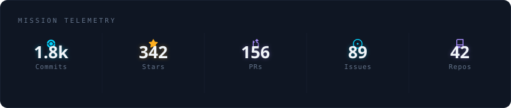

# Rivandiilham

Saya adalah mahasiswa Teknologi Informasi yang memiliki ketertarikan besar pada pengembangan perangkat lunak dan infrastruktur cloud. Saat ini, saya aktif mempelajari berbagai teknologi mulai dari pemrograman web, kecerdasan buatan, hingga sistem operasi. Saya percaya bahwa teknologi adalah alat untuk memecahkan masalah nyata, dan saya sedang dalam perjalanan untuk menjadi seorang arsitek solusi digital yang handal.

Apa yang saya kerjakan saat ini:

📚 Menempuh pendidikan S1 di jurusan Teknologi Informasi.

🛠️ Mengembangkan project portofolio untuk tugas kuliah dan pengembangan diri (seperti website, aplikasi, atau analisis data).

🌱 Mempelajari bahasa pemrograman Python, TypeScript, serta dasar-dasar Docker dan Linux.

Mari terhubung! Saya sangat terbuka untuk diskusi seputar teknologi, kolaborasi project, atau kesempatan magang.

## Preview

  

 

  

 

  

 

  

